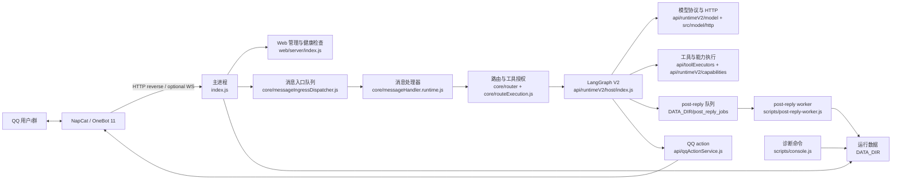

# 架构地图与代码落点

> 源码核验时间：2026-08-04 12:42 +08:00（Asia/Shanghai）。本项目正处于从历史目录向 `src/` 分域迁移的阶段，目录名不能单独代表实现所有权。

本文用于回答三个问题：进程如何协作、代码当前由谁实现、一个新改动应该放在哪里。

## 1. 架构总览

MizukiBot 是 CommonJS Node.js 单仓库应用。根目录 `index.js` 是生产主进程的 composition root；QQ 消息经 NapCat 进入消息管线，路由后调用 LangGraph V2、模型和工具，最终通过 NapCat action 发回。回复后的记忆与向量维护可以由独立 worker 异步完成。



这张图是职责图，不表示所有调用都是单向网络请求。例如 LangGraph 节点会读取上下文、checkpoint 和工具策略，主进程也会直接写入部分运行状态。

## 2. 进程边界

| 进程/入口 | 主要职责 | 持有的长生命周期资源 | 不应承担 |
| --- | --- | --- | --- |
| 主进程 `index.js` | 配置校验、单实例、Web、NapCat ingress/action、消息处理、调度和优雅停机 | Web/HTTP reverse server、可选 WebSocket、message ingress dispatcher、scheduler、SQLite/hot stores | 重型回复后记忆工作，除非明确启用 inline worker |
| post-reply worker `scripts/post-reply-worker.js` | 消费回复后任务、记忆提取、物化和向量维护 | worker 单实例锁、队列轮询、worker readiness、SQLite/hot stores | 接收 NapCat 消息、发送主回复、启动 Web 管理服务 |
| console `scripts/console.js` | 配置检查和定向诊断 | 仅命令执行期间加载的配置/存储 | 常驻服务、交互式 REPL、替代生产健康检查 |
| Web 服务 `web/server/index.js` | `/live`、`/ready`、管理页面和受保护 API | Express server、session/rate-limit 状态 | 直接成为模型或消息域的实现 owner |
| 测试/诊断脚本 `scripts/*.js` | 离线验证、迁移、审计、导出 | 临时目录或显式 `DATA_DIR` | 隐式修改生产数据 |

### 主进程启动链

`npm start` 的真实链路是：

```text
package.json#start
  -> node index.js
  -> config.validateRequiredConfig()
  -> acquireSingleInstanceLock()
  -> startServer()
  -> initializeMemeManager()
  -> startNapCatTransport()
  -> waitForServerListening()
  -> runtimeReadiness.markReady()
```

NapCat 事件进入后，高层链路是：

```text
acceptNapCatIncomingMessage()
  -> prepareNapCatEventPacket()
  -> acceptIncomingMessage()
  -> messageIngressDispatcher.enqueue() 或 handleIncomingMessage()
  -> createMessageHandler(...).handleIncomingMessage()
  -> 路由 / 执行计划 / LangGraph V2
  -> replyRuntime / qqActionService
```

入口队列负责限制全局 active/queued 数量；`handleIncomingMessage()` 内部还会按群聊/私聊、用户和会话获取并发锁。这两层不能互相替代。

## 3. 顶层目录边界

| 路径 | 当前职责 | 修改时的边界 |
| --- | --- | --- |
| `index.js` | 主进程 composition root 和生命周期 | 只做接线、启动、停机和 transport 选择；不要把业务规则继续堆进来 |
| `src/` | 新的分域入口与已迁移实现：features、memory、message、model、runtime-v2、shared | 是迁移目标，但不是所有模块的实现源；先沿 `require()` 找 owner |
| `core/` | QQ 消息、路由、调度、主动/被动行为及仍未迁走的核心实现 | 消息管线仍大量由这里拥有；`.chunk.js` 可能是保留兼容资产，不能当垃圾删除 |
| `api/` | LangGraph V2、模型编排、工具 schema/executor、外部服务适配和公共兼容入口 | `api/runtimeV2/host` 仍是图运行时 owner；不要把它误当成纯 HTTP API 层 |
| `utils/` | 跨域策略、存储、记忆实现、prompt 编译、诊断、并发和运行时基础设施 | 新增前检查是否已有同职责模块；有状态 helper 必须有唯一 owner |
| `config/` | `.env` 解析、默认值、校验、prompt runtime 配置 | 配置变更要同步 `.env.example` 和窄测试；不要在这里执行领域行为 |
| `prompts/` | 系统 prompt、persona、动态模块、runtime 模板和 manifest | `prompt-manifest.json` 决定正式资产；运行时模板由代码显式引用 |
| `web/` | 本地管理 Web 服务、鉴权、session、安全头和页面路由 | Web handler 调用领域服务，不复制领域实现 |
| `scripts/` | 启动、测试、诊断、迁移、部署与维护入口 | 脚本应显式接收路径/参数，危险操作要有守卫，测试数据用临时目录 |
| `tests/` | 单元、回归、模块边界和源码协议测试 | 新行为补最窄测试；迁移还要补导出 identity、惰性加载和 require 边界测试 |
| `data/` | 默认运行数据库、日志、队列、checkpoint、缓存和导出 | 运行数据，不是源码；默认不提交，删除需要明确授权 |
| `skills/` | agent 可发现的技能包和其脚本/参考资料 | 与主运行时工具注册边界分开；不要把通用应用逻辑藏进 skill |
| `deploy/` | Linux、Docker 和部署说明/脚本 | 不承载本地业务实现 |
| `docs/` | 开发、运维、诊断、计划和参考文档 | 长期事实写开发文档；历史计划不能替代当前源码核验 |
| `artifacts/` | 评估、备份和一次性验收产物 | 默认本地；提交必须脱敏并有正式文档引用 |

## 4. 依赖方向

仓库整体仍是迁移中的单体，不能声称已经形成严格分层 DAG。新代码应遵循下面的方向：

```text
进程入口 / Web / scripts
  -> 稳定公共入口或领域 owner
    -> 领域服务与运行时节点
      -> 外部适配器 / store / policy
        -> config 与纯 helper
```

具体规则：

1. `index.js` 可以装配 `core/`、`api/`、`web/` 和 `utils/`，下层模块不能反向 `require('../index')`。
2. 叶子实现不要依赖自己的 `index.js` 或宽 barrel；这会制造循环依赖并破坏冷启动惰性加载。
3. 门面只做转发和兼容，不放新业务逻辑。调用方应该观察同一个导出对象、函数和 singleton。
4. 模型 transport、LanceDB、物化器、完整工具注册表等重依赖应保持调用期加载；不要因为“导入方便”把它们带回热路径。
5. `config` 可以提供已解析值，但领域模块不要重新解析 `.env`；同一配置只有一个解释位置。
6. 共享可变状态只允许一个 owner。其他模块持有引用或调用 API，不能复制 `Map`、缓存或 store singleton。
7. 数据路径从 `config.DATA_DIR` 或其明确子配置派生；不要在领域模块另造一个默认 `./data` 口径。
8. 独立工作树执行真实数据诊断时，相对 `MEMORY_LANCEDB_DIR` 会按当前工作目录解析；必须显式传入真实 `DATA_DIR` 和绝对 LanceDB 路径，并在 apply 前核对输出路径。

## 5. `src/` 与历史目录的迁移事实

### 5.1 `src/` 是迁移目标，不是绝对真相

根入口 `src/index.js` 暴露 `features`、`memory`、`message`、`model`、`runtimeV2` 和 `shared`。它提供统一发现面，但每个分域的实现归属不同。

已由 `src/` 持有实现的典型链路：

```text
core/memeManager.js              -> src/features/meme
core/passiveGroupAwareness.js    -> src/features/passive-awareness
core/dailyShareEngine.js         -> src/features/daily-share
api/httpClient.js                -> src/model/http
业务记忆读写                    -> utils/memory-v3/repository.js
utils/vectorMemory.js            -> src/memory/vector（仅兼容/迁移）
api/runtimeV2/context/service.js -> src/runtime-v2/context
api/graphPrompting.js            -> api/runtimeV2/context/service -> src/runtime-v2/context
```

这些旧路径是兼容门面。新增逻辑应放到右侧 owner，左侧通常只保留一行 `module.exports = require(...)`。

### 5.2 仍由历史目录持有实现的典型链路

消息处理器当前是明确例外：

```text
core/messageHandler.js
  -> src/message/handler.js
  -> core/messageHandler.runtime.js
```

`src/message/handler.js` 是稳定公共入口，但实际实现仍在 `core/messageHandler.runtime.js`。`core/messageHandler.js` 与 `src/message/handler.js` 必须返回同一导出对象。`core/messageHandler.runtime-*.chunk.js` 是 legacy-retained 边界资产，当前生产入口不执行 chunk loader；不要只改 chunk 期待生产行为变化，也不要未经授权删除它们。

类似地：

- `src/message/ingress`、`routing`、`reply`、`dispatch` 目前分别转发到 `core/messageIngress.js`、`core/router/index.js`、`core/messageReplyRuntime.js`、`core/messageDispatchCoordinator.js`；
- `src/memory/v3`、`context`、`journal`、`cli` 目前分别转发到 `utils/memory-v3`、`utils/memoryContext`、`utils/dailyJournal`、`utils/memoryCli`；
- `src/runtime-v2/host` 转发到 `api/runtimeV2/host`，图编译、Agent 决策与工具执行节点仍由 `api/` 持有；
- `src/runtime-v2/context` 持有动态上下文实现，`api/runtimeV2/context` 保留运行时接线；旧的 direct-chat 计划模块和 `src/runtime-v2/planning` 已移除。

结论：修改前必须执行“从公共入口沿 `require()` 追到第一个非门面实现”的动作，不能按路径名称猜测。

### 5.3 门面不变量

迁移或新增门面时，至少保持：

- 导出 key 不变；
- 导出函数 identity 不变，避免无意义包装；
- singleton/cache identity 不变；
- 冷门面不加载主 barrel 或重依赖；
- 旧公开路径仍可 `require()`；
- 不通过新反向依赖重建循环。

现有边界测试示例：

- `tests/messageHandlerModuleBoundary.test.js`；
- `tests/runtimeContextModuleBoundary.test.js`；
- `tests/memeModuleBoundary.test.js`；
- `tests/passiveAwarenessModuleBoundary.test.js`；
- `tests/dailyShareModuleBoundary.test.js`；
- `tests/memoryVectorModuleBoundary.test.js`；
- `tests/refactorSrcFacades.test.js`；
- `tests/hotpathRequireGuard.test.js`。

## 6. 主消息与模型链路

开发者阅读主回复时，推荐按以下顺序追踪：

1. `index.js`：`acceptNapCatIncomingMessage()`、`acceptIncomingMessage()` 和 `createMessageHandler()` 的接线；
2. `core/messageIngressDispatcher.js`：异步队列、active 上限、drop 和 drain；
3. `core/messageHandler.runtime.js`：`createMessageHandler()` 与 `handleIncomingMessage()`；
4. `core/router/index.js`：`detectIntentHybrid()`；
5. `core/routeExecution.js`：`resolveRouteExecution()` 把 route 变成 executor/tool/stream 约束，并且只能收窄 Router 给出的工具集合；
6. `core/messageRouteFlow/index.js`：`dispatchFormalRoute`/`dispatchByRoutePlan()`；
7. `api/agentGraph.js` -> `api/agentGraphFacade.js` -> `api/agentGraphV2.js`；
8. `api/runtimeV2/host/index.js`：`createRuntime()`、LangGraph 节点装配和 `askAIByGraphV2()`；
9. `api/runtimeV2/topology.js`：图节点与条件边；
10. `api/runtimeV2/model/service.js`、`api/runtimeV2/model/shared.js` 和 `src/model/http/`：provider request、stream、retry 和 transport。

LangGraph V2 的主拓扑是：

```text
prepare -> enhance_live_state -> route -> agent_decide
agent_decide -> execute_tools -> agent_decide -> ...
agent_decide -> humanize -> final_validate -> persist -> END
```

`core/router` 是工具授权的唯一来源，只有 `route.meta.allowedTools` 明确列出的工具可以暴露给模型；后续执行层只能取交集收窄，不能扩权。无工具路由保留流式回复，工具路由缓冲中间轮次，只发送最终答案。不要绕过 `persist` 节点自行复制回复后写入逻辑。

`core/researchTaskQueue.js` 与 `core/researchSubagent.js` 仅为历史研究 brief 兼容保留，生产消息流不再入队；历史 brief 仍可读取。

## 7. 数据所有权

`config/index.js` 在加载时解析 `DATA_DIR`，默认是仓库根目录 `data/`，并在目录不存在时创建。测试和诊断应通过环境变量或参数把它重定向到临时目录。

| 数据类型 | 默认位置/owner | 规则 |
| --- | --- | --- |
| 主进程状态、NapCat 健康、request trace、模型调用日志 | `DATA_DIR` 下对应 JSON/JSONL/NDJSON | 主进程和诊断只通过既有 writer/API 访问，不直接拼接第二份格式 |
| LangGraph checkpoint/event | 新写入：`DATA_DIR/langgraph_v2.sqlite`；只读兼容：`DATA_DIR/langgraph_v2_checkpoints`、`DATA_DIR/langgraph_v2_events` | `saveTransition()` 原子提交 checkpoint/event；legacy 只按 thread 惰性读取，禁止扫描、回写和批量迁移；`clear()` 通过 tombstone 防止旧数据复活 |
| post-reply 队列与 trace | `DATA_DIR/post_reply_jobs`、`DATA_DIR/post_reply_traces` | 主回复链生产任务，worker 消费；inline 与独立 worker 只能选一种消费模式 |
| worker readiness | `DATA_DIR/runtime/post-reply-worker/worker-state.json` | 独立 worker owner；不要由 Web 或主进程伪造 ready |
| Memory V3 | `DATA_DIR/memory-v3` | 事件日志是长期记忆业务真值；通过 `utils/memory-v3/repository.js`、materializer 和 worker 管理，禁止手改 projection 当作源数据 |
| SQLite/profile/worldbook | `DATA_DIR/*.sqlite` 或对应配置路径 | 通过 store 模块访问；进程停机时统一关闭已加载连接 |
| 短期会话 | `DATA_DIR/short_term_sessions` 等 | session key 和 scope 必须使用既有 resolver，不能另造命名规则 |
| prompt | `prompts/` + `prompt-manifest.json` | 是版本化源码资产，不属于 `DATA_DIR`；私有 prompt 仍不得提交 |
| 生成图片、skill cache、上传临时文件 | `DATA_DIR/create-agent`、`skill_cache`、`qzone_uploads` 等 | 运行产物，不进入源码目录，也不默认提交 |

`DATA_DIR` 是多进程共享边界，不代表任何文件都能被所有进程随意写。判断 owner 时查看配置项、store 模块和进程角色；不确定时先增加只读诊断，不要增加第二个 writer。LangGraph SQLite 逻辑坏行由 store 原子隔离到 quarantine，物理完整性失败必须 fail closed；连接由 Runtime reset 和 `utils/sqliteRuntime.js` 统一关闭。

## 8. 新代码落点决策

按下面顺序判断，不要先新建目录再找理由。

### 第一步：是否已有 owner

从现有公共入口沿静态 `require()` 追踪：

```bash
rg -n "module\.exports|require\(" <候选入口和相邻模块>
```

如果找到已有 owner，就在 owner 附近增加最小模块；不要在 facade 里实现同一份逻辑。

### 第二步：按职责选择目录

| 需求 | 首选落点 | 说明 |
| --- | --- | --- |
| 主进程启动、信号、监听器接线 | `index.js` 或专用 lifecycle helper | 根入口只保留 orchestration，复杂逻辑下沉 |
| QQ ingress、消息预处理、路由、回复发送 | 当前 owner `core/`；对外从 `src/message` 暴露 | 未完成迁移前不要新建第三套消息管线 |
| 独立产品功能 | `src/features/<feature>/` | 参考 meme、daily-share、passive-awareness；旧 `core/` 路径只做兼容 facade |
| LangGraph 节点、图路由、Agent 工具执行 | `api/runtimeV2/` | 图 host、`agent_decide` 和 `execute_tools` 当前由这里拥有 |
| Runtime V2 动态上下文 | `src/runtime-v2/context` | 保持显式依赖和重依赖惰性加载 |
| 模型 HTTP 协议/重试/transport | `src/model/http/` | `api/httpClient.js` 是兼容 facade |
| 模型请求编排、fallback、输出解析 | `api/runtimeV2/model/` | 不要把 provider 编排塞回通用 HTTP transport |
| 长期记忆业务读写 | `utils/memory-v3/repository.js` | `queryMemory` 是业务召回入口；旧 vector store 只允许兼容模式和迁移工具访问 |
| Memory V3、context、journal、CLI | 先修改当前 `utils/` owner，再保持 `src/memory/*` facade | `MEMORY_STORAGE_MODE=v3_only` 时不得加载或写入旧 JSON/shard |
| 跨域纯函数/策略 | 最窄的 `utils/<domain>/` | 不要建立新的 `utils/<misc>.js` |
| 环境配置 | `config/` + `.env.example` | 默认值、校验、文档和测试一起改 |
| prompt 资产 | `prompts/` + manifest/runtime 引用 | 必须通过 `npm run check:prompts` |
| Web route/UI | `web/` | 调用领域 API，不复制 store/业务规则 |
| 诊断、迁移、维护入口 | `scripts/` | 默认只读；写操作需要显式参数、备份和验收 |

### 第三步：检查是否引入新的状态或重依赖

新增缓存、队列、数据库连接或 singleton 前，必须回答：

1. 谁创建它？
2. 谁关闭或刷写它？
3. 主进程与 worker 是否会同时加载？
4. 热路径 `require()` 是否因此加载数据库、LanceDB、完整工具注册表或网络 client？
5. 是否已有同用途 owner 可以复用？

回答不清楚时，先停止实现并补架构证据。

### 第四步：用边界测试收口

行为测试之外，根据变化选择：

- facade/迁移：导出 key、严格 identity、require cache、cold load；
- 消息入口：去重、队列满、并发锁、shutdown drain；
- 模型：provider request body、stream fallback、retry 和 token budget；
- prompt：manifest、golden snapshot、动态 block 和注入防护；
- 数据：临时 `DATA_DIR`、单 writer、原子写/锁和恢复；
- 进程：单实例、readiness、信号 drain。

## 9. 禁止的架构捷径

- 不要因为 `src/` 看起来更新，就把所有旧模块批量搬进去。
- 不要在 facade 中加条件分支、缓存、fallback 或参数改写。
- 不要新增 `any` 式绕过、吞错 `try/catch` 或与相邻代码不一致的防御层。
- 不要从叶子模块导入 `src/index.js`、`src/message/index.js` 等宽入口。
- 不要复制 store 状态来解决循环依赖；应提取更小的中性依赖。
- 不要把 `.chunk.js` 当作自动生成垃圾。先看实际入口和模块边界测试。
- 不要让测试读取默认生产 `data/`；使用临时 `DATA_DIR`。
- 不要在 Web route、脚本或 prompt 模板里实现第二份领域规则。
- 不要用历史计划文档代替当前源码。计划描述的是当时状态，`require()` 链和边界测试才是当前证据。

## 10. 修改前的最小核验清单

```bash
git status --short
rg -n "module\.exports|require\(" <准备修改的入口和相邻文件>
rg -n "<关键导出名>" tests src core api utils
```

确认以下事项后再编辑：

- 已找到真实 implementation owner；
- 已识别所有兼容 facade；
- 已找到对应边界测试或决定补充哪一个；
- 已确认数据 owner 和进程角色；
- 已确认不会覆盖并行代理或开发者的现有改动；
- 修改范围不需要新增顶层目录或批量迁移。
