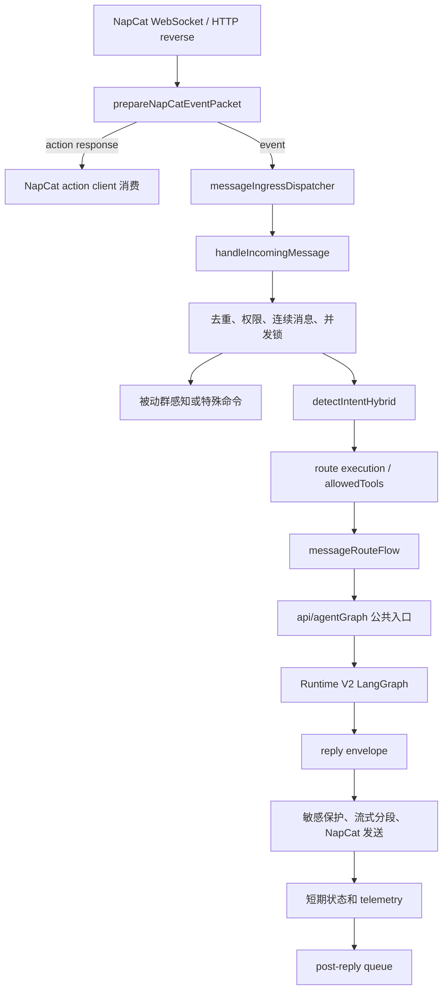

# 消息与 Agent 运行时

本文面向需要修改消息入口、路由、Agent 图、工具执行、回复发送或后台副作用的开发者。它描述当前分支真实运行链路，而不是目录名暗示的理想架构。最后核验：2026-08-04 +08:00。

读完后应能回答：一条 OneBot 消息在哪里被接收、在哪些位置可能提前返回、何时进入 Runtime V2、工具如何受策略约束、回复如何防重复与过期，以及回复后的持久化为何不应阻塞用户可见结果。

## 先认识稳定边界

| 边界 | 稳定入口 | 当前实现所有者 | 说明 |
| --- | --- | --- | --- |
| 主进程 | [`../../index.js`](../../index.js) | 同文件组合各运行时 | 单实例锁、Web/NapCat、后台调度、就绪与优雅关停都从这里接线 |
| 消息处理器 | [`../../core/messageHandler.js`](../../core/messageHandler.js) | [`../../core/messageHandler.runtime.js`](../../core/messageHandler.runtime.js) | `core/messageHandler.js` 是兼容入口；运行逻辑仍在大型 runtime 文件 |
| 新消息命名空间 | [`../../src/message/index.js`](../../src/message/index.js) | `src/message/` 与 `core/` 混合 | 迁移期 facade，不代表所有实现已经移动到 `src/` |
| Agent 公共 API | [`../../api/agentGraph.js`](../../api/agentGraph.js) | [`../../api/runtimeV2/host/index.js`](../../api/runtimeV2/host/index.js) | 保留旧调用签名，但 V2 是唯一主机 |
| 图结构 | [`../../api/runtimeV2/topology.js`](../../api/runtimeV2/topology.js) | `api/runtimeV2/nodes/` | 节点名、固定边和条件边的真值来源 |
| 路由执行 | [`../../core/messageRouteFlow/index.js`](../../core/messageRouteFlow/index.js) | 同目录与消息处理器 | 把领域路由和 Router 工具授权交给统一 Agent 入口 |
| 回复出口 | [`../../core/messageReplyRuntime.js`](../../core/messageReplyRuntime.js) | 同文件及系统回复模块 | 用户可见文本净化、敏感词保护、流式分段与 QQ 发送 |
| 回复后任务 | [`../../utils/postReplyJobQueue/index.js`](../../utils/postReplyJobQueue/index.js) | `utils/postReplyWorker/` | 日记、学习、Memory V3 事件、物化和质量维护 |

不要直接把 `*.chunk.js` 当作扩展入口。仓库中部分 chunk 是历史拆分产物或源码级回归哨兵；新增行为应落在上表的实现所有者，公开导出通过稳定入口暴露。

## 推荐阅读顺序

第一次阅读不要顺着 `core/messageHandler.runtime.js` 从第一行看到最后一行。按下面的窄链路走，能更快建立正确模型。

1. [`../../index.js`](../../index.js)：只看 `createMessageHandler`、`acceptIncomingMessage`、`acceptNapCatIncomingMessage`、`connectNapCat`、`startNapCatTransport`、`startMainProcess` 和关停组合。
2. [`../../core/messageIngressDispatcher.js`](../../core/messageIngressDispatcher.js)：理解进程级异步入口队列的容量、丢弃和 drain 语义。
3. [`../../core/messageIngress.js`](../../core/messageIngress.js)：理解 notice、消息类型、自消息过滤和标准化 `InboundMessageContext`。
4. [`../../core/messageHandler.runtime.js`](../../core/messageHandler.runtime.js)：用函数名搜索 `createMessageHandler` 和 `handleIncomingMessage`，只追当前改动涉及的早退分支。
5. [`../../core/messageRouteFlow/index.js`](../../core/messageRouteFlow/index.js)：看正式路由怎样构造 reply envelope，以及何时调用 Agent。
6. [`../../api/agentGraph.js`](../../api/agentGraph.js) -> [`../../api/agentGraphFacade.js`](../../api/agentGraphFacade.js) -> [`../../api/agentGraphV2.js`](../../api/agentGraphV2.js)：确认公共签名如何进入 V2 host。
7. [`../../api/runtimeV2/topology.js`](../../api/runtimeV2/topology.js)：先读图，再按需进入 `api/runtimeV2/nodes/`。
8. [`../../api/runtimeV2/host/index.js`](../../api/runtimeV2/host/index.js)：最后看组合根、依赖注入、checkpoint 和 `askAIByGraphV2`。
9. [`../../core/messageReplyRuntime.js`](../../core/messageReplyRuntime.js) 与 [`../../api/runtimeV2/nodes/persist.js`](../../api/runtimeV2/nodes/persist.js)：分别确认“已发送”和“已持久化”不是同一件事。
10. [`../../utils/postReplyWorker/processJob.js`](../../utils/postReplyWorker/processJob.js)：理解慢副作用如何继续执行。

每读一个模块，同时搜索它的调用者与对应测试：

```bash
rg -n "目标导出名|目标文件名" index.js api core src utils tests
rg -n "module\.exports|exports\." path/to/module.js
```

## 主进程生命周期

### 启动

`index.js` 在加载配置后创建消息处理器、NapCat action client、主动消息引擎、scheduler 和可选内联 post-reply worker。`startMainProcess()` 的顺序具有行为意义：

1. 获取 `.mizukibot.lock` 对应的单实例锁，避免两个主进程竞争同一个 OneBot 连接。
2. 清理过期临时文件，启动 Web 服务并初始化 meme 管理器。
3. 按配置安排 Memory V3 embedding backfill 和资源快照。
4. 启动 HTTP 反向入口，同时尝试 NapCat WebSocket。
5. 等 Web 与 HTTP reverse server 真正监听后，才把 readiness 标记为 ready。

`startConnectedRuntimes()` 是连接后的组合点，负责启动主动消息、tick、daily journal summary、scheduler、post-reply worker 和 NapCat log follower。新增需要随连接启停的后台能力，应接入这个生命周期或抽成与它同级的 runtime；不要在模块顶层悄悄启动定时器。

### 重连

WebSocket `close` 会记录离线状态并按递增延时重连，上限 30 秒。`connectNapCat()` 会拒绝在 shutdown、已有 OPEN 或 CONNECTING 连接时重复创建 socket。HTTP reverse 与 WebSocket 可以同时存在，因此入站去重不能依赖“只有一个 transport”。

### 关停

`createMainProcessLifecycle` 按阶段执行：停止接收 -> 停止运行时 -> drain worker -> 清理外部资源 -> flush 热存储和 SQLite -> 释放单实例锁。消息入口的 `stop({ drain: true })` 与 post-reply worker 的 `drainAndStop()` 都受关停超时约束。

新增资源必须明确归入以下一种所有权：

- 可停止 runtime：提供幂等 `stop()`。
- 可 drain worker：提供带超时的等待语义。
- 外部连接：提供关闭或清缓存函数。
- 持久化资源：在 finalize 阶段完成 flush/close。

只监听 `process.on('exit')` 不足以保证异步清理完成。

## 一条消息的端到端链路



### 1. Transport 只负责接收和 action 响应分流

WebSocket `message` 与 HTTP reverse handler 都调用 `acceptNapCatIncomingMessage()`。它先执行 `prepareNapCatEventPacket()`：

- 记录 NapCat packet 日志。
- 可选交给 follower 处理 live packet。
- 让 `napcatActionClient.handleMessage()` 消费带 echo 的 action 响应。
- 只有非 action 响应事件才继续进入消息处理器。

这里不应放业务路由。Transport 的职责是解析、连接状态、认证、重连和把事件交给统一入口。

### 2. 进程级入口队列限制总压力

启用 `MESSAGE_INGRESS_ASYNC_ENABLED` 后，`acceptIncomingMessage()` 只把任务压入 `createMessageIngressDispatcher()`。dispatcher 使用全局 `maxActive` 和 `maxQueueLength`：

- 队列满时明确丢弃并记录快照，而不是无限积压。
- 单个 handler 失败只增加失败计数，不让 drain 循环停止。
- shutdown 可以停止接收后等待 active 与 queue 清空。

它只限制“进入 handler 的总量”，不保证同一用户、同一会话或前台模型调用的顺序；这些约束在消息处理器内第二次实施。

### 3. 消息处理器先完成廉价过滤和特殊分支

`handleIncomingMessage()` 的前半段顺序应保持廉价检查优先：

1. notice 处理；非 message、未知 message type、自消息直接返回。
2. request trace 和 inbound timing 建立。
3. `message_id` 等事件键去重，防止双 transport 或重投递重复处理。
4. 私聊 allowlist、Luckin 命令、`/create`、主动消息控制、meme 上传等特殊入口。
5. 连续消息预处理：合并短时间内的片段，解析 reply/forward/card；返回 `deferred` 时本轮不继续。
6. 选择 private/default 入站并发池，获取 per-user 锁。
7. 解析图片、引用、@、卡片与 directed context，构造标准 `InboundMessageContext`。

特殊命令通常在通用 Agent 之前返回。新增特殊入口时必须说明为什么不能成为正常 route/capability，并补充“未命中时继续走主链”的测试；否则很容易扩大热路径并绕过统一安全、记忆和 telemetry。

### 4. 群聊是否直达 Bot 决定主动与被动链路

非私聊且没有 direct bot anchor 时，消息进入 `runPassiveFlow()`，最终由 [`../../src/features/passive-awareness/reply.js`](../../src/features/passive-awareness/reply.js) 编排感知、规则 gate、模型决策、presence 状态和可选回复，然后主链返回。

私聊或明确 @/引用 Bot 的消息继续正式路由。此处还会处理视觉 caption、card-only 修正、短期 session key、stable thread id 和 freshness guard。

### 5. Router 同时决定路由与工具授权

消息处理器调用 `detectIntentHybrid()` 得到高层 `topRouteType`、清洗文本和 route metadata。`core/router` 同时写入 `route.meta.allowedTools`，它是本轮工具授权的唯一上界；普通聊天默认空列表，明确的读取、搜索、卡片比较或写操作意图才开放对应工具。共享链接与最多三张卡片等确定性规则也在 Router 内完成。

`routeExecutionPlan` 只把 Router 结果转成 executor、stream 和运行时约束。它以及后续 preflight、请求参数都只能取交集收窄 `allowedTools`，不能新增 Router 未授权的工具。不要只新增 route 字符串而不更新 Router allowlist、工具策略和测试。

符合严格条件的普通文本可能走 normal fast reply。这是独立热路径，发送成功后自己更新短期历史和副作用；失败才回退正式路由。修改主回复行为时要先确认问题是否只发生在 fast path、formal path，还是两者共有的回复出口。

### 6. 正式路由把消息交给 Agent 公共 API

`createMessageRouteFlow()` 根据路由约束处理管理员、后台控制、不可用分支和正式 Agent 调用。普通聊天、前台工具请求、后台消息处理和任务续写最终共用保留的调用签名：

```js
askAIByGraph(question, userInfo, userId, customPrompt, imageUrl, options)
```

`api/agentGraph.js` 只是公共壳，`api/agentGraphFacade.js` 即使收到历史 V1 名称也会转到 V2。`LANGGRAPH_RUNTIME_VERSION` 现在只是兼容告警，不再选择旧主机。

`options` 不是纯输入：V2 host 会回填 `persistedReplyText`、`displayReplyText`、`reasoningText`、`reasoningForwardText`、流式状态和安全限制标志。修改这个契约时，必须同时检查 message route flow、stream dispatcher、telemetry 和 persist 的消费者。

## Runtime V2 图

图结构以 `LANGGRAPH_V2_TOPOLOGY` 为准：

```text
prepare -> enhance_live_state -> route -> agent_decide
agent_decide -> execute_tools -> agent_decide -> ...
agent_decide -> humanize -> final_validate -> persist -> END
```

### 节点职责

| 节点 | 主要职责 | 常见修改原因 |
| --- | --- | --- |
| `prepare` | 恢复 checkpoint/短期状态、构建记忆与 prompt、能力预检、延迟预算 | 改上下文输入、prompt 预算、恢复语义 |
| `enhance_live_state` | 把当前动态状态补入准备结果 | 改实时状态增强，不应承担通用路由 |
| `route` | 规范化图模式并把所有正式请求送入统一 Agent | 增加图级模式 |
| `agent_decide` | 调用主模型原生 tool calls；无调用时确定最终正文 | 改模型决策、强制结束或 provider 归一化 |
| `execute_tools` | 校验并执行当前批次，写入 tool messages 与 execution envelope | 改授权、并行、重复调用或副作用 checkpoint |
| `humanize` | 按路由决定润色/流式最终文本 | 改人格润色或分段，不应改事实 |
| `final_validate` | 失败回复分类、prompt 安全和最终保护 | 改最后一道安全/失败判定 |
| `persist` | 写短期状态、事件并排队慢副作用 | 改持久化或后台任务边界 |

每个包含 tool calls 的模型响应算一个工具轮次，最多 `AGENT_MAX_ROUNDS=3`；越权、参数错误、重复和批次超限调用都计入累计调用数，累计最多 `DIRECT_TOOL_MAX_CALLS_PER_TURN=4`。达到任一上限后，`agent_decide` 以空工具集再调用主模型一次；仍无正文时使用受控失败回复并停止。普通无工具路由可流式输出，工具路由只在循环结束后输出最终答案，中间模型文本不会发送给用户。

### 工具执行不是任意函数调用

工具从 capability registry 和 executors 解析，经以下层次约束：

1. Router 生成 `route.meta.allowedTools`，执行层只能收窄该集合。
2. capability preflight 验证可用性。
3. [`../../utils/toolPolicy/manifest.js`](../../utils/toolPolicy/manifest.js) 按工具名和规范化 action 解析版本化 policy。
4. 两个 Runtime V2 执行入口验证公开静态注册或真实动态 MCP 注册，未知工具、internal executor 和未知 action 默认阻断。
5. Runtime V2 direct、scheduler 和 legacy 最终都通过 [`../../api/toolAuthorization.js`](../../api/toolAuthorization.js) 调用 executor。
6. scheduler 按同一 policy 决定 batch、只读缓存、是否可并行以及 side-effect 顺序。
7. `execute_tools` 只并行安全的只读调用；副作用严格按顺序执行，并在调用前后持久化 checkpoint。
8. 每一步返回标准 execution envelope，并作为 tool result 回灌主模型；重复调用复用已有结果，不重新执行。

policy 至少声明 `risk/capability/effect/confirmation/scope/idempotency/replay/exposure`。混合读写工具必须按 action 解析；未携带 action 时使用保守写入策略。动态 MCP 只以 `api/toolRegistry.js` 的精确注册名称为准，`mcp_*` 前缀或 descriptor metadata 不能作为注册证明。

需要增加工具时，必须同时补 Router allowlist 规则、schema、executor、manifest policy 和测试，并运行 `npm run check:agent:static`。不要在 `agent_decide` 中写工具名特判，也不要让写入/删除/外发能力进入只读缓存或并行批次。

`confirmation=none` 直接执行；`explicit` 和 `admin_explicit` 只创建一次性票据，并返回确定性的 `/tool-confirm <ID>` 与 `/tool-cancel <ID>`。消息入口在连续消息聚合和模型路由前解析这两个命令，票据必须匹配原用户、private/group 类型和群号；`admin_explicit` 在确认时再次读取当前管理员配置。

票据保存在 [`../../utils/toolAuthorizationStore.js`](../../utils/toolAuthorizationStore.js)，状态只允许 `pending -> executing -> completed|uncertain`、`pending -> cancelled|expired`。确认执行前重新校验参数和上下文哈希、schema、完整 policy、静态公开能力或动态 MCP 精确注册；领取票据使用 SQLite 条件更新。executor 开始后的异常、进程中断和完成状态落盘失败都进入 `uncertain`，execution envelope 固定 `retryable=false`，不能由 Agent 自动重试。终态会清除原始参数与上下文，但保留摘要哈希和 `tool_authorization_decision` 审计事件。

### Checkpoint 与恢复

Runtime V2 使用 [`../../utils/langgraphV2Store.js`](../../utils/langgraphV2Store.js) 持久化节点快照和事件。新写入端是 `DATA_DIR/langgraph_v2.sqlite`：普通节点通过 `saveTransition()` 在一个事务中提交 checkpoint 与关联 event，副作用前后边界也必须各自使用原子 transition，不能重新拆成两个独立写入。

Agent checkpoint 保存 `messages`、待执行调用、工具轮次、累计调用数、调用指纹、完成调用 ID、执行结果和强制结束原因。恢复时从未完成调用继续；副作用调用的完成状态已经在调用后 checkpoint 中确认，不得重放。关键事件为 `agent_decision`、`agent_tool_round`、`agent_tool_result`、`agent_limit_reached` 和 `agent_forced_final`。

旧 `langgraph_v2_checkpoints/` 和 `langgraph_v2_events/` 只做按 thread 惰性兼容读取，不启动扫描、不批量迁移、不回写。checkpoint 以 SQLite 优先，仅在无 SQLite 记录时回退 legacy；event 在无 tombstone 时合并 legacy 与 SQLite。`clear(threadId)` 在同一事务删除 SQLite checkpoint/event 并永久保留 tombstone，后续写入不能移除 tombstone。

thread id 必须稳定关联当前会话/请求；`runPersistInBackgroundFromCheckpoint(threadId)` 会重新加载 checkpoint，并仅把 `deferPersist` 改为 false 后执行 persist 节点。SQLite 逻辑坏行会原子移入 quarantine 后删除源行，物理损坏直接 fail closed；Runtime reset 和全局 shutdown 会关闭连接。`npm run diag:runtime -- --json` 的 `components.langGraphV2Store.sqlite` 提供 health、`quickCheckMessages`、checkpoint/event/quarantine、active/stale 和字节数，legacy 规模继续单独报告。

因此，节点应尽量返回可序列化状态，不要把 socket、client、闭包或巨大原始响应放进 graph state。运行时依赖由 host 组合根注入，不由 state 携带。

## 回复出口与可见结果

Agent 返回的文本先组成 reply envelope。它至少区分：

- `replyText`：当前用户可见文本；
- `persistedReplyText`：进入历史和学习链路的规范文本；
- `reasoningText` / `reasoningForwardText`：受单独策略控制，不能混入主回复；
- `usedStreamingSend` 与 `replyOptions`：防止流已发送后再重复发送整段；
- `freshness`：新消息到达后丢弃旧回复。

`messageReplyRuntime` 在最终发送前执行用户可见文本净化和 sensitive guard。群聊通常通过 `systemGroupReply` 排队，私聊走 private reply；流式 dispatcher 自己串行 chunk、控制间隔、限制段数，并在每次 send 前再次检查 freshness。

只有 NapCat action 返回成功才算“已发送”。文本已由模型生成、已写入 checkpoint 或已进入 `replyEnvelope` 都不能作为发送成功的证据。

## 三层并发与新鲜度

并发问题必须先定位层次：

1. `messageIngressDispatcher`：进程级总入口容量，保护 event loop。
2. `createInboundConcurrencyController`：private/default 分池，区分 admin/general，并限制 per-user inflight。
3. `createForegroundConcurrencyController`：限制昂贵前台模型任务，并给管理员保留槽位。

连续消息预处理还有自己的 debounce/session；stream dispatcher 有自己的发送串行队列；post-reply worker 又是独立队列。不要用一个全局 mutex 试图覆盖所有层。

freshness guard 使用 session key 与递增版本防止旧回复覆盖新上下文。任何新发送路径若绕过 `sendReply`/stream dispatcher，都必须显式携带 `shouldSend` 或等价的新鲜度判断。

## 前台持久化与后台任务

`persist` 节点负责对当前图状态做最小且必要的提交，包括短期历史、session 状态、bridge snapshot、persona outcome 和 post-reply job。对于 direct chat，消息层可以设置 `deferPersist`，在用户可见发送后通过 checkpoint 继续 persist，降低首包延迟。

post-reply job 的任务依赖定义在 [`../../utils/postReplyWorker/taskRegistry.js`](../../utils/postReplyWorker/taskRegistry.js)：

- `memoryLearning`、`selfImprovement`、`dailyJournal`；
- `memoryEvent` -> `materialize` -> `vectorMaintenance`；
- materialize 后可做 `memoryQualityAudit` 和 `profileMaintenance`；
- enrich phase 独立处理更重的增强。

任务状态、attempt、lease 和 completedTasks 用于幂等恢复。新增后台步骤必须声明依赖、fatal/nonfatal 策略、压力下是否可跳过，并让 job result 保持 JSON 可序列化。

`core/researchTaskQueue.js` 与 `core/researchSubagent.js` 仍保留历史代码，但生产入口已经断开，不会产生新研究任务；已有 research brief 仍可读取。

## 关键开发契约

### 公共入口与实现文件分开

- 外部调用继续从 `api/agentGraph.js`、`core/messageHandler.js` 或领域 index 导入。
- 新实现落在真实所有者；不要为了“路径更现代”复制一份逻辑到 facade。
- 改导出形状前先读模块边界测试，尤其是 [`../../tests/messageHandlerModuleBoundary.test.js`](../../tests/messageHandlerModuleBoundary.test.js)。

### 组合根负责依赖注入

消息处理器和 V2 host 都支持 override/deps 注入。测试应替换网络、模型、时钟或存储依赖，而不是 monkey-patch 全局模块缓存。业务模块不应自行 new 第二个 action client 或 runtime singleton。

### route metadata 是跨层协议

`routePolicyKey`、`routeDebugKey`、`topRouteType`、`allowedTools`、`groupId`、`chatType`、`threadId`、`messageId` 和 request trace 会穿过路由、prompt、工具策略、发送、持久化和诊断。`allowedTools` 是不可突破的授权上界。添加字段时要决定：是否可序列化、是否进入 checkpoint、是否含敏感信息、是否需要出现在 post-reply job。

### 失败必须保留类型

模型空回复、provider 失败、工具失败、发送失败、stale reply 和 rate limit 是不同故障。不要把它们都吞成一句通用回复；保留 `finalErrorCode`、failure type、节点和 request trace，用户文本再由统一失败回复处理。

## 常见改动落点

| 目标 | 首选落点 | 同时检查 |
| --- | --- | --- |
| 新 OneBot notice | `core/messageIngress.js` | NapCat ingress 测试、是否需要业务 side effect |
| 新消息级特殊命令 | `core/messageHandler.runtime.js` 中廉价早退区 | 权限、未命中回落、private/group 差异、memory skip 日志 |
| 新工具确认命令 | `core/messageToolAuthorization.js` | 同用户/聊天绑定、管理员复验、过期与重复确认、模型路由前早退 |
| 新高层路由 | 当前 intent router 与 message route flow | execution plan、policy key、prompt 与路由测试 |
| 新 Agent 图分支 | `api/runtimeV2/topology.js` 与独立 node | state shape、checkpoint、条件路由、LangGraph 测试 |
| 新工具能力 | Router、capability registry/executor/policy | allowlist、preflight、副作用顺序、execution envelope |
| 改流式回复 | `core/messageReplyRuntime.js` 与 V2 streaming coordinator | chunk 去重、最终 flush、新鲜度、私聊/群聊间隔 |
| 改回复后学习 | persist node 或 post-reply task | 前台延迟、幂等、job 依赖、失败重试 |
| 新随进程运行的 scheduler | `index.js` 生命周期组合 | readiness、重连、stop/drain、资源快照 |

## 高风险误区

- 把 `MESSAGE_INGRESS_ASYNC_MAX_ACTIVE` 当成同一用户串行保证。它只控制总量。
- 在 WebSocket 和 HTTP reverse 各写一套业务处理，导致双入口行为漂移。
- 在模型返回后直接发送，绕过 sensitive guard、freshness 和 reply telemetry。
- 流式已发送后又走标准发送，产生重复回复。
- 在 graph state 放不可序列化对象，导致 checkpoint 恢复失败。
- 在 `agent_decide` 内新增工具特判，绕开 Router allowlist、capability policy 和 execution envelope。
- 把 `confirmation_required` 或 `uncertain` 当作普通工具失败交给模型自动重试，导致副作用重复执行。
- 只在消息文本中展示确认命令，却没有持久化票据、原子领取和当前身份/policy 复验。
- 把 post-reply 失败当成主回复失败，拖慢或重复用户可见回复。
- 修改 chunk 或兼容 sentinel，却没有改变真实入口。
- 用“进程没有报错”代替发送、持久化或 drain 的实际验收。

## 验证命令

### 消息入口与并发

```bash
node scripts/run-tests.js tests/napcatWsIngressSmoke.test.js tests/messageIngressDispatcher.test.js tests/messageHandlerInboundConcurrency.test.js
```

验收点：WebSocket/HTTP 事件都进入统一 handler；队列容量和 drain 生效；同一用户限制不被全局并发绕过。

### 模块边界、路由与回复

```bash
node scripts/run-tests.js tests/messageHandlerModuleBoundary.test.js tests/messageRouteFlowGroupStreaming.test.js tests/messageReplyRuntimeFreshness.test.js
```

验收点：facade 导出不变；流式路径不重复最终发送；新消息能阻止过期回复。

### Runtime V2 与持久化

```bash
node scripts/run-tests.js tests/reactAgentLoop.test.js tests/langgraphV2SqliteStore.test.js tests/runtimeV2Persistence.test.js tests/toolPolicyRuntimeEffects.test.js tests/runtimeStatusDiagnostics.test.js tests/sqliteRuntimeShutdown.test.js
```

验收点：多轮工具调用和强制结束；checkpoint/event 原子提交及回滚；恢复不重放副作用；只读并行、Router allowlist、legacy 惰性兼容、诊断和连接关闭。

### 诊断现有运行实例

```bash
npm run diag:napcat-health
npm run diag:route-decision
npm run diag:main-reply
npm run diag:main-reply-lag
npm run diag:runtime
node scripts/inspect-post-reply-jobs.js
```

排查时用同一个 message/request/thread 标识串起 ingress、router、Runtime V2、reply send 和 post-reply 证据。重启只能恢复进程状态，不能证明竞态、发送失败或持久化错误已经修复。

继续阅读记忆、prompt 和 persist 内部结构时，转到 [记忆与提示词](04-memory-and-prompts.md)。
