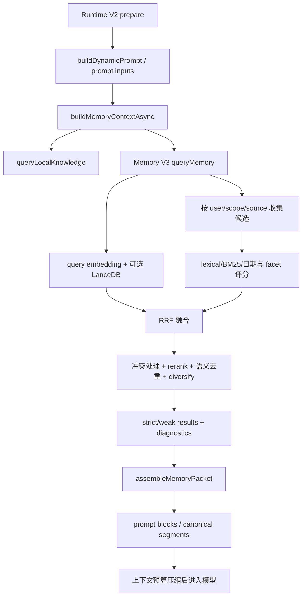
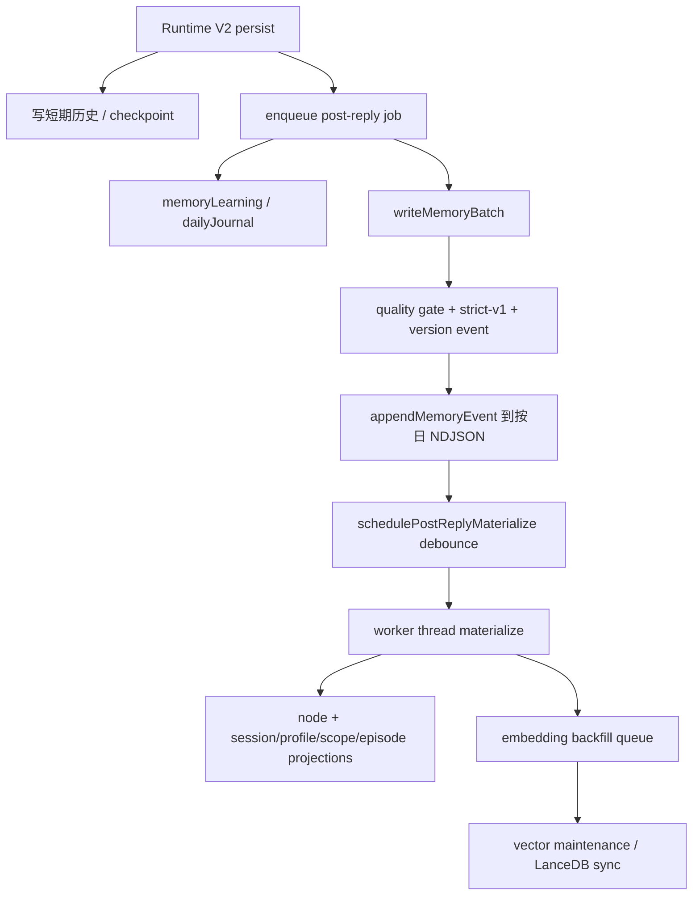

# 记忆与提示词

本文面向需要修改对话连续性、用户档案、日记、Memory V3、向量召回、prompt 资产或上下文预算的开发者。它把“存了什么”“怎样召回”“哪些证据能进入模型”分开说明。最后核验：2026-08-25 11:15 +08:00。

关系阶段、边界、态度和角色短期状态不属于 Memory V3 事实召回，统一由 [`../../utils/conversationVariables/index.js`](../../utils/conversationVariables/index.js) 从 SQLite 快照提供。完整变量定义、提案门槛、迁移和控制台接口见 [`../conversation-variables.md`](../conversation-variables.md)。

最重要的原则是：Memory V3 事件日志是长期记忆业务真值，Profile Journal 是可重建结构化读模型，LanceDB 是在线向量索引。短期会话、Daily Journal、图片索引和 LangGraph 状态仍有独立职责；任意一层成功都不能替代端到端召回与注入验收。

## 模块地图

| 层 | 稳定入口 | 当前实现 | 职责 |
| --- | --- | --- | --- |
| Memory 命名空间 | [`../../src/memory/index.js`](../../src/memory/index.js) | `src/memory/` 与 `utils/` | 向新代码提供 cli/context/journal/v3/vector 聚合入口 |
| 兼容用户记忆 | [`../../utils/memory/index.js`](../../utils/memory/index.js) | `utils/memory/` | favorites、profile、facts、summary、impression、chat history 与 short-term store |
| 短期连续性 | [`../../utils/shortTermMemory/index.js`](../../utils/shortTermMemory/index.js) | `utils/shortTermMemory/` | session key、最近轮次、压缩、重启恢复、连续性 delta |
| 每日日记 | [`../../utils/dailyJournal/index.js`](../../utils/dailyJournal/index.js) | `utils/dailyJournal/` | 原始轮次、segment、4-day/monthly rollup 与按日期召回 |
| Memory V3 | [`../../utils/memory-v3/repository.js`](../../utils/memory-v3/repository.js) | `utils/memory-v3/` | 统一业务读写、事件、物化投影、packet、版本更新与治理 |
| 用户记忆管理 | [`../../src/features/companion-memory/index.js`](../../src/features/companion-memory/index.js) | `src/features/companion-memory/` | 私聊用户查看、保存、更正、遗忘自己的长期记忆并控制自动记忆 |
| 旧向量兼容入口 | [`../../utils/vectorMemory.js`](../../utils/vectorMemory.js) | [`../../src/memory/vector/index.js`](../../src/memory/vector/index.js) | `legacy_compat` 镜像/主读、`v3_shadow` 对照和迁移读取；不是新业务入口 |
| LanceDB | [`../../utils/lancedbMemoryStore/index.js`](../../utils/lancedbMemoryStore/index.js) | `utils/lancedbMemoryStore/` | Memory V3 可见节点的在线向量索引、分区、同步和搜索 |
| Prompt manifest | [`../../prompts/prompt-manifest.json`](../../prompts/prompt-manifest.json) | [`../../config/promptRuntime.js`](../../config/promptRuntime.js) | 稳定系统 prompt 资产、阶段、优先级、预算和冲突 |
| 运行时 prompt | [`../../utils/runtimePrompts.js`](../../utils/runtimePrompts.js) | `prompts/runtime/` 与内置默认值 | 带变量的任务/路由/格式模板 |
| 主回复上下文 | [`../../src/runtime-v2/context/index.js`](../../src/runtime-v2/context/index.js) | `src/runtime-v2/context/` | 聚合记忆、人格、动态块、缓存 lane 与视觉上下文 |
| Prompt block 规范 | [`../../utils/mainReplyPromptBlocks/catalog.js`](../../utils/mainReplyPromptBlocks/catalog.js) | 同目录 | block 的 lane、criticality、启用条件与硬预算 |

`src/memory/v3/index.js`、`src/memory/context/index.js`、`src/memory/journal/index.js` 和 `src/memory/cli/index.js` 目前主要转发到 `utils`。业务代码通过 `utils/memory-v3/repository.js` 读写；`utils/vectorMemory.js` 反向转发到旧实现，只允许兼容层、shadow 和迁移工具使用。共享 embedding 与余弦能力由 `utils/memoryEmbedding.js` 持有。

## 推荐阅读顺序

### 只想理解一次主回复用了哪些记忆

1. [`../../src/runtime-v2/context/prompt-inputs.js`](../../src/runtime-v2/context/prompt-inputs.js)：看主回复收集 memory context 的入口和超时预算。
2. [`../../utils/memoryContext/index.js`](../../utils/memoryContext/index.js)：看 legacy/V3 选择、profile、journal 和 prompt-safe 文本。
3. [`../../utils/memoryContext/v3Payload.js`](../../utils/memoryContext/v3Payload.js)：看 V3 query、fallback、packet 和注入数据结构。
4. [`../../utils/memory-v3/query.js`](../../utils/memory-v3/query.js)：看混合召回总编排。
5. [`../../utils/memory-v3/packet.js`](../../utils/memory-v3/packet.js)：看 strict/weak/persona/relationship 如何受预算约束。
6. [`../../src/runtime-v2/context/dynamic.js`](../../src/runtime-v2/context/dynamic.js)：看稳定块、动态块和 assistant-only 块如何合并。
7. [`../../api/runtimeV2/host/runtimeHelpers.js`](../../api/runtimeV2/host/runtimeHelpers.js)：看 canonical segments 与最终上下文压缩。

### 想理解一条记忆怎样写入并最终可召回

1. [`../../api/runtimeV2/nodes/persist.js`](../../api/runtimeV2/nodes/persist.js)：前台最小持久化和 post-reply job 构造。
2. [`../../utils/postReplyWorker/taskRegistry.js`](../../utils/postReplyWorker/taskRegistry.js)：后台任务依赖图。
3. [`../../utils/postReplyWorker/processJob.js`](../../utils/postReplyWorker/processJob.js)：真实任务执行顺序。
4. [`../../utils/memory-v3/repository.js`](../../utils/memory-v3/repository.js)：统一质量门、`strict-v1` 判定、版本事件和存储模式行为。
5. [`../../utils/memory-v3/versionedUpdate.js`](../../utils/memory-v3/versionedUpdate.js)：相似记忆、归档旧版本与确认新事件。
6. [`../../utils/memory-v3/events.js`](../../utils/memory-v3/events.js)：事件标准化、按日 NDJSON append 和同步旁路。
7. [`../../utils/postReplyWorker/materialize.js`](../../utils/postReplyWorker/materialize.js)：debounce、dirty scopes 与增量物化调度。
8. [`../../utils/memory-v3/materializer.js`](../../utils/memory-v3/materializer.js)：投影、冲突、生命周期、embedding backfill 和 LanceDB 同步计划。
9. [`../../utils/memory-v3/embeddingIndex.js`](../../utils/memory-v3/embeddingIndex.js) 与 [`../../utils/postReplyWorker/vectorMaintenance.js`](../../utils/postReplyWorker/vectorMaintenance.js)：向量补齐与维护。

### 想修改向量写入或召回算法

1. [`../../utils/memory-v3/repository.js`](../../utils/memory-v3/repository.js)：长期记忆业务写入与查询边界。
2. [`../../utils/memory-v3/query.js`](../../utils/memory-v3/query.js)、`queryScoring.js` 和 `queryRanking.js`：混合召回、评分与排序。
3. [`../../utils/memoryEmbedding.js`](../../utils/memoryEmbedding.js)：Memory V3 与 persona worldbook 共用的 embedding/余弦能力。
4. [`../../utils/lancedbMemoryStore/index.js`](../../utils/lancedbMemoryStore/index.js)：在线向量索引、同步、reconcile 和搜索。
5. [`../../src/memory/vector/index.js`](../../src/memory/vector/index.js)：旧 JSON/shard 兼容与迁移边界；不得从新业务代码直接调用。

## 记忆类型不是互相替代的

### 短期会话状态

`chatHistory` 与 `shortTermMemory` 来自 `utils/memory`，实际由 short-term session store 支撑。session key 通过用户、群组/频道和当前会话解析，避免同一用户在不同群的最近上下文串线。

短期层保存最近轮次、presence、active topic、carry-over user turn、压缩摘要和重启恢复信号。它服务当前对话连续性，不能承担长期档案；达到预算后会压缩或裁剪，且某些 fast path 会直接读取它。

修改短期状态 shape 时必须同步检查：

- `utils/shortTermMemory/` 的 state、compression、restart recall；
- Runtime V2 prepare 和 conversation context；
- `core/messageHandler.runtime.js` 的路由连续性信号；
- checkpoint 恢复与 session summary 测试。

### 兼容 Profile 与 affinity

`utils/memory` 仍维护 favorites 和 legacy memory/profile。它负责 facts、summary、impression 和兼容 API；关系读取优先走 conversation variables，旧 affinity 仅在迁移前或新库不可用时回退。写入有缓存、dirty set、原子落盘与退出 flush。

这是兼容层，不等于 Memory V3 的事件真值。新长期事实优先经过受控写入或 V3 事件；只有明确维护兼容调用者时才直接扩展 legacy shape。管理员 affinity 还有保护逻辑，不能通过普通提取覆盖。

### Daily Journal

`utils/dailyJournal` 记录带时间和 session 的对话轮次，再按配置生成 segment、4-day 和 monthly rollup。召回会区分“昨天/具体日期/最近发生什么”等 intent，必要时读取 active raw，而不是永远只取最新摘要。

日记是 episode/time evidence，不应直接升级为稳定身份或偏好。`utils/memory-v3/journalPipeline.js` 可以把 rollup 生成 V3 episode 事件，但 profile projection 仍有自己的字段和证据规则。

### Memory V3

Memory V3 采用事件日志 + 可重建投影：

- `writeMemoryBatch()` 是业务写入入口，先执行既有质量门，再应用 `strict-v1`，最后追加版本事件并返回 accepted/archived/rejected。
- `queryMemory()` 是业务召回入口；`v3_shadow` 只把旧结果写入差异诊断，不让旧结果进入 Prompt。
- 事件是追加真值，类型包括 turn、checkpoint、candidate、confirmed、archived、episode rollup 和 migration bootstrap。
- materializer 从事件重建 session/profile/scope/episode projection 与 memory node 列表。
- query 从投影、node、journal、task/group/style 等来源收集候选并排序。
- packet 把召回结果变成受预算约束的 prompt 片段。

不要直接编辑 projection 文件“修记忆”。投影应能从事件重建；需要纠正时写版本更新/归档事件，或使用已有 changeset/governance 能力。

### 用户可控记忆中心

`companion_memory` 是当前私聊用户管理长期记忆的产品入口，动作包括 `list`、`remember`、`correct`、`forget`、`settings` 和 `set_auto`。工具执行器从当前私聊上下文取得 `userId`，领域服务不会接受调用者指定另一个用户；群聊调用直接拒绝。`list/settings` 是只读操作，`remember/correct/set_auto` 进入本地写入确认，`forget` 进入破坏性确认。

查看记忆读取当前用户的 Memory V3 active node；保存走 `writeMemoryBatch()`，更正写入替代版本后归档旧 node，遗忘通过 `archiveMemory()` 追加归档事件。它们都不直接修改 projection、embedding cache 或 LanceDB。`legacy_compat` 下，归档会按同一记忆 ID 和用户同步归档旧镜像；否则旧主读可能在 V3 已遗忘后再次返回原内容。

自动记忆偏好按用户保存到 `COMPANION_MEMORY_SETTINGS_FILE`，默认开启。关闭后统一跳过：

- post-reply 隐式画像与事实提取；
- 每轮 `turn_summary` 长期写入；
- enrich phase 的长期学习。

关闭自动记忆不等于停止所有上下文和记录。私聊 `conversationVariablesOnly`、用户明确“请记住”的显式写入、短期会话状态、Daily Journal 原始轮次、分段与压缩继续运行。修改开关判定时必须同时验证这些保留路径，不能把隐式长期学习开关扩大为整条 post-reply worker 的总开关。

### Vector 与 LanceDB

Memory V3 node 是事件物化结果，符合策略的 active node 进入 embedding cache 与 LanceDB。LanceDB 只保存可重建的在线向量索引，不拥有业务真值；向量不可用时，`queryMemory()` 仍通过 lexical/BM25/日期路径降级。

`MEMORY_STORAGE_MODE` 控制迁移期行为：

- `legacy_compat`：默认值。业务写入先落 V3，再镜像 accepted 项到旧 store；兼容读路径仍可主读旧投影。
- `v3_shadow`：业务读写以 V3 为准，旧 store 只读并只生成差异统计，不进入 Prompt，也不接受写入。
- `v3_only`：正式收敛模式，不加载或写入 `memory_items.json`、`memory_index.json`、`memory_library.json`、`memory_projection.json` 与 `memory-shards/`。

旧 vector 模块保留为迁移工具，不物理删除。任何向量改动都必须验证远程 embedding 不可用、LanceDB 无候选和 `v3_only` 缺失旧文件三条路径。

## 一条主回复的读取链路



### 1. `buildMemoryContextAsync` 按存储模式选择路径

Runtime V2 的 prompt input 把 user、question、group/session/route/tool metadata 交给 `buildMemoryContextAsync()`。`legacy_compat` 保持旧主读行为；`v3_shadow` 和 `v3_only` 进入 `buildMemoryContextV3Payload()`，并通过仓储 `queryMemory()` 查询。

`v3_shadow` 的旧召回只写入 `diagnostics.storageShadow`，不会合并进 V3 results 或 Prompt。`v3_only` 不允许回退到旧 JSON/shard；不要在上层看到空数组就静默塞入 legacy facts，这会破坏“无证据不注入”的语义。

### 2. `queryMemory` 先建立 recall plan

query 根据问题和显式参数确定：

- facet：continuity、preference、identity、task、group、style、journal、relationship 或 default；
- journal 目标日期与 recent recall intent；
- allowed sources、scope、候选预算、是否允许远程 embedding/rerank；
- source/category plan 和 query rewrite。

scope 至少要带 user；群记忆还受 readable group ids 约束。改变过滤规则时，最先验证跨群泄漏和 private/group 边界，而不是只看 top-1 分数。

### 3. 混合召回与降级

`collectCandidates()` 从当前可读投影和来源收集本地候选。之后：

1. 可用时解析 query embedding，并使用 query cache。
2. LanceDB read 开启且 embedding 可用时执行向量搜索，再把向量行解析回当前可见候选。
3. 本地构造 lexical/BM25 pool，同时保留日期和 recent fallback 候选。
4. 多组候选存在时通过 RRF 融合。
5. 做冲突消解，并对已在 head/tail 中或后补的目标日期日记幂等施加硬优先级，确保它不会被普通相关性吞掉。
6. 对有限 head 执行 rerank，tail 保留原顺序。
7. 对 journal/long-term 重复项做语义折叠，并按来源和 facet diversify。

返回值同时包含 `results`、`strictResults`、`weakResults`、persona、affinity、source coverage、timings、fusion snapshot 和 projection freshness。调用者不应只保留文本而丢掉 diagnostics，否则无法解释“为什么召回了这条”。

### 4. Packet 与 prompt 注入是第二道质量门

`assembleMemoryPacket()` 不会把所有 query results 原样塞入系统 prompt。它按 strict/weak、persona、relationship 和 token budget 生成 packet。`memoryContext/v3Payload` 再区分 journal/task/group/style 等块，并执行：

- 当前群可见性过滤；
- daily journal 目标日期选择；
- legacy fallback 是否禁用；
- prompt 最大 token/字符裁剪；
- `memoryTrace` 的 injected block ids 和 dropped reasons。

“query 命中”与“最终注入”是两个验收点。调排序后应同时检查 query diagnostics 和主 prompt assembly。

## 一条后台写入与物化链路



### 1. 前台只提交最小状态

persist 节点把最终问答、route metadata、continuity snapshot 和任务结果写入短期层，并生成 post-reply job。direct chat 可延迟 persist 到发送后从 checkpoint 恢复执行。

前台持久化必须可重复：重试不能重复追加同一轮历史或创建不受控的后台 job。job 使用稳定 hash、task states 和 completed tasks 支持恢复。

### 2. 后台 worker 分离不同记忆产品

`processPostReplyJob()` 的 core phase 可以同时做：

- `learnSomethingNew()`：抽取 profile/fact 候选并交给 `writeMemoryBatch()`；
- `appendDailyJournalEntry()`：写 episode/time evidence；
- `writeMemoryBatch()`：让候选经过质量门与 `strict-v1` 后以版本事件进入 V3；
- materialize、向量维护、质量审计和 profile maintenance。

这些输出不能混为一个“memory write 成功”布尔值。某个非 fatal 维护任务失败时，已确认事件仍可能存在；诊断必须看 task state。

### 3. 版本更新先处理相似与 supersession

`writeMemoryBatch()` 先分类 accepted/archived/rejected；accepted 项再由 `appendVersionedMemoryUpdate()` 查找相似现有 node。若是同一语义槽的新版本，可先追加 archive/supersede 事件，再追加 confirmed 事件，并可更新运行时摘要。纠正、冲突和弱证据由 profile lifecycle 与治理模块进一步处理。

手工新增长期事实时使用 `writeMemoryBatch()`；迁移/恢复等基础设施才直接追加规范事件。不要直接 append 不完整对象到 NDJSON。

### 4. 事件追加是写入真值

`events.js` 会：

1. 验证 event type 并标准化用户、session、scope、source、status、confidence、importance、semantic slot、conflict key 和文本。
2. 对显式纠正语句执行 profile correction 检测，必要时生成归档事件。
3. 生成稳定 event id。
4. 按 UTC 日期选择 NDJSON 文件，通过共享 JSON-line writer 追加。
5. 可选立即 flush，并同步 profile journal DB。

事件 writer 默认可能缓冲；materializer 读取前会先 flush pending writes。测试中若 append 后直接读文件，需要使用公开加载函数或显式 flush 语义，不要依赖时序巧合。

### 5. Materializer 负责可重建视图

post-reply materialize 默认 debounce，多次 job 会合并 dirty user/session/group scope。`materializeMemoryViewsAsync()` 优先在线程 worker 执行，失败时记录 perf event 并回退同步 materialize。

物化过程：

1. 资源压力高时可延迟，`force` 才绕过。
2. 获取 materialize lock；活锁返回 deferred，过期/死亡进程锁可清理。
3. flush 并读取全部事件，按语义 key 去重。
4. scope 数量在限制内时只重建 dirty scopes，否则全量重建。
5. 创建 node，应用 profile lifecycle、near-duplicate merge、supersession、冲突消解、recall-hidden 和 evidence tier。
6. 生成 session/profile/scope/episode projection 和 node JSONL。
7. 通过临时文件/rename 原子写 projection，更新 event high watermark。
8. 为可向量化 node 排入 embedding backfill，并返回 LanceDB sync plan。

投影的 `materializedAt`、`eventHighWatermarkTs` 和 query freshness diagnostics 是判断“事件已写但召回尚未可见”的关键证据。

## 向量写入质量门

`utils/memory-v3/repository.js` 的批量写入不是简单 append：

1. 标准化 candidate、scope、status、source 和 metadata。
2. 运行 `utils/memoryWritePipeline` 的 propose、batch guards 和 validate。
3. 对现有 active node 与本批候选应用 `strict-v1`，确定性命中直接追加 archived 事件。
4. accepted 项通过版本化 update 追加 confirmed/archived 事件；rejected 项不进入 active。
5. 整批只物化一次，并安排 embedding 与 LanceDB 同步。
6. 仅 `legacy_compat` 将 accepted 项镜像到旧 store；`v3_shadow` 与 `v3_only` 零旧写入。

新增字段时至少同步 candidate normalization、事件 schema、materializer、query scoring、LanceDB row 和测试 fixture。只在 write 接受字段但 retrieval 丢失它，会形成“事件存在、永远搜不到”的隐性坏数据。

## Prompt 的四个层次

### 1. Manifest 管稳定资产

`prompts/prompt-manifest.json` 由 `config/promptRuntime.js` 和 `utils/promptManifest.js` 加载。每个 section 具有 id、path、required、kind、stage、priority、budget、authority、applies_when、conflict_tags 和 required_variables。

适合放 manifest 的内容：稳定人格基线、长期系统约束、共享安全规则。新增 required section 会影响所有匹配阶段；缺文件或无变量会使检查失败，应先评估是否真的必须全局生效。

### 2. Runtime prompt 管有变量模板

`utils/runtimePrompts.js` 从 `prompts/runtime/<template>.txt` 读取模板，缺文件时使用代码内默认值，并按文件 mtime/size 缓存。模板变量使用 `{{name}}`；缺少实际使用的变量会抛错，多传变量会记录为 unused。

适合放 runtime prompt 的内容：route guidance、planner、streaming segmentation、review、视觉语用等。不要在调用点拼接一份同义长字符串，避免模板和默认值漂移。

### 3. Dynamic context blocks 管当前轮状态

`src/runtime-v2/context` 把 memory、persona、affinity、daily journal、continuity、directed context、style/social state、memory CLI 和 scheduler 等内容编译成块。

每个 block 通过 catalog 声明：

- lane：stable system、dynamic context 或 assistant-only；
- criticality 与 empty policy；
- `mustUseWhen`/`useWhen`/`avoidWhen`；
- 配置预算键与 hard cap。

记忆相关的 `memory_recall_policy`、`retrieved_memory_lite`、`daily_journal`、`short_term_continuity` 等均有独立预算。不要把多个来源提前拼成一个不可拆的大块，否则 compaction 无法按价值裁剪，也无法诊断具体 dropped block。

### 4. Canonical segments 管最终上下文预算

V2 host 在发模型前把内容整理为 canonical segments：system prompt、route prompt、continuity、short-term summary、recent history、assistant-only context、user turn、tool evidence 和 planner artifact。`buildContextCompactionPlan()` 根据模型窗口、预留输出 token 和优先级压缩。

因此，prompt 修改要验证三个层次：资产是否加载、block 是否被选中、压缩后是否仍在最终 messages。仅检查 `buildDynamicPrompt()` 返回文本不够。

## Prompt 与记忆的关键契约

### 稳定人格不能被召回事实覆盖

稳定系统 prompt 的 authority 高于动态记忆。记忆证据只提供事实、连续性和关系信号，不能修改系统身份、安全边界或工具权限。Memory V3 也对 bot persona/profile 字段做单独投影和证据筛选。

### 弱证据必须可见为弱

query 将 strict 和 weak 分开，packet 和 prompt trace 应保留这个区分。不要把 rerank 分数高直接等同于已确认事实；source kind、evidence count、lifecycle status、conflict 和 recall verification 同样参与可信度。

### 群记忆遵守 scope

group-scope item 只有在当前 readable group ids 内才可召回和注入。当前群 prompt 还会再次过滤 group hits。新增 cross-group 共享能力必须是显式产品决定，不能通过放宽查询条件顺手实现。

### 外部 recall 需要去重

MemOS、OpenViking 和本地 Memory V3 可能命中同一事实。Runtime context 在 prompt 前有去重与 source policy；不要简单并排注入三份相同记忆。外部服务不可用时，本地链路仍要正常回答。

### Prompt 是不可信数据的边界

记忆文本、日记、工具证据和网页内容都可能包含指令样式文本。它们是证据，不是高权限规则。最终上下文应保持 block 标签、authority 和 prompt security 检查，不要把 recalled text 插到稳定 system preamble 之前。

## 常见改动落点

| 目标 | 首选落点 | 必须联动检查 |
| --- | --- | --- |
| 改短期连续性 | `utils/shortTermMemory/` | session key、压缩、重启恢复、fast/formal 两条主回复 |
| 新增长期 profile 字段 | V3 category/profile projection 与 materializer | event payload、conflict key、evidence、packet、legacy surface |
| 改记忆写质量 | `utils/memory-v3/repository.js` 与 `utils/memoryWritePipeline/` | reject/archive reason、strict-v1、版本事件、整批物化 |
| 改 V3 排名 | `queryPolicy`、`queryScoring`、`queryRanking` | scope、journal 日期、RRF、rerank tail、diagnostics |
| 增加记忆来源 | `queryCandidates` 与 source plan | allowed sources、category manifest、prompt formatter、trace |
| 改 LanceDB | `utils/lancedbMemoryStore/` | row schema、分区、shadow/fallback、全量同步脚本 |
| 新 prompt 资产 | manifest 或 `prompts/runtime/` | loader、required variables、stage、预算、prompt checks |
| 新动态 block | `src/runtime-v2/context` 与 block catalog | lane、criticality、empty policy、cache fingerprint、compaction |
| 改 prompt token 预算 | catalog/config 与 canonical segments | 模型窗口、预留输出、fallback、诊断测试 |
| 改日记召回 | dailyJournal retrieval 与 journal recall policy | 时区、目标日期、active raw、rollup 去重 |

## 高风险误区

- 直接改 projection 或 embedding cache，把可重建派生数据当真值。
- 从生产业务代码直接调用旧 vector store，绕过 V3 仓储与存储模式。
- 事件 append 成功后立刻断言 query 可见，忽略 materialize debounce 和 high watermark。
- 只测 embedding 正常路径，忽略远程不可用、本地 lexical 和 LanceDB fallback。
- 把 group item 只按 userId 过滤，造成跨群泄漏。
- 改 profile 字段但没有更新 conflict/evidence/lifecycle，导致新旧值同时注入。
- 将 `weakResults` 当 strict facts 注入模型。
- 在 prompt 调用点拼长字符串，绕过 manifest/runtime template/cache 和 prompt check。
- 把动态用户/记忆内容放进稳定 cache lane，污染后续 session。
- 只验证 prompt 源文本存在，不检查最终 canonical messages。
- 增加无限制 token 预算，把上下文溢出推给模型端截断。

## 数据检查与诊断

Memory V3 默认根目录、事件目录、治理 run、四类 projection、node JSONL 和 embedding cache 都由 `config/index.js` 的 `MEMORY_V3_*` 配置解析；存储行为由 `MEMORY_STORAGE_MODE` 解析。不要在脚本或测试中硬编码默认 data 路径。Daily Journal 同样以配置的目录和时区为准。

独立工作树读取部署数据时，`.env` 中相对 `MEMORY_LANCEDB_DIR` 会相对工作树解析。真实 convergence 预检必须同时显式设置部署 `DATA_DIR` 和绝对 `MEMORY_LANCEDB_DIR`，并核对计划中的 `legacyArchive.dataDir`、诊断中的 `lancedbDir` 后才可接受结果。

优先使用现有只读诊断：

```bash
npm run diag:memory
npm run diag:memory-rag-explain -- --user <userId> --query "<query>"
npm run diag:continuity
npm run diag:main-reply-prompt
node scripts/diagnose-lancedb-memory.js
node scripts/inspect-post-reply-jobs.js
```

一次完整诊断至少记录：query facet/source plan、projection freshness、候选数、LanceDB fallback reason、rerank 是否应用、selected item id/source、injected block ids、dropped reasons 和最终 prompt token 统计。

## 验证命令

### 写入质量与 V3 基础链路

```bash
node scripts/run-tests.js tests/memoryWritePipeline.test.js tests/memoryWritePipelineQualityGate.test.js tests/memoryV3Query.test.js tests/memoryV3MaterializerProfile.test.js
```

验收点：坏候选被明确拒绝；confirmed/archived 事件能重建投影；query 遵守 profile 与 scope。

### 召回、向量与回退

```bash
node scripts/run-tests.js tests/memorySemanticRecall.test.js tests/memoryV3LanceDbRecall.test.js tests/memoryRecallAndLanceDbGates.test.js tests/memoryReranker.test.js
```

验收点：语义命中可解释；LanceDB 可融合；gate 关闭或向量不可用时本地召回仍工作；rerank 不丢 tail。

### Prompt 注入与预算

```bash
node scripts/run-tests.js tests/memoryContextProfileInjection.test.js tests/memoryPacketBudget.test.js tests/runtimeV2MainReplyMemoryOrder.test.js tests/runtimeV2PromptTimeoutMemoryFallback.test.js tests/runtimePromptCache.test.js
npm run check:prompts
```

验收点：profile/记忆顺序稳定；packet 不超预算；超时时产生可诊断 fallback；cache 不跨会话污染；manifest 和模板变量通过检查。

### 后台物化与并发

```bash
node scripts/run-tests.js tests/memoryV3MaterializeWorker.test.js tests/memoryV3EmbeddingBackfillConcurrency.test.js tests/postReplyTaskRunner.test.js tests/postReplyJobQueueConcurrency.test.js
```

验收点：worker fallback 可用；backfill 和 job lease 不重复处理；materialize 依赖发生在 memory event 之后。

### 存储收敛与可逆治理

```bash
node scripts/run-tests.js tests/memoryV3Repository.test.js tests/memoryV3StrictArchive.test.js tests/memoryV3Convergence.test.js tests/memoryV3LegacyArchive.test.js tests/memoryV3ConsumerBoundary.test.js
node scripts/migrate-memory-v3.js --converge --dry-run
```

第一条命令验证仓储、归档幂等/恢复、计划应用/回滚、旧文件无损归档和生产消费者边界。第二条命令只生成真实数据预检计划；不得在未检查计划和运行态门禁时继续 `--apply-plan`。若 run 状态停在 `applying`，必须执行 `--rollback-run <runId|plan.json>`。

若改动跨越消息发送与 persist 边界，再运行 [消息与 Agent 运行时](03-message-and-agent-runtime.md) 中的 Runtime V2、回复新鲜度和 post-reply 回归集。
