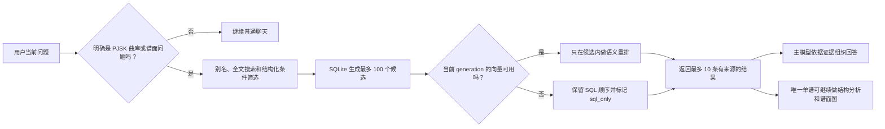

# PJSK 曲库 RAG 原理与机制

更新时间：2026-08-05 11:10 +08:00

## 一句话说明

机器人不是靠模型“背下整套曲库”来回答，而是在收到问题后，先从当前本地曲库中查出符合条件的真实记录，再把这些记录作为证据交给模型组织成自然语言回答。

这就是 RAG，也就是“检索增强生成”：先检索证据，再生成回答。模型负责理解问题和表达结果，数据库负责提供曲名、作者、难度、等级、物量和谱面结构等事实。

## 一次查询如何完成

这条流程有两个关键约束：向量检索不能绕过数据库候选，模型也不能凭空添加数据库里没有的曲目。

## 数据从哪里来

系统把日服 master 数据作为唯一事实库，通过只读镜像获取曲目、作者、演唱版本、角色、难度、官方等级、官方物量和发布时间。简中库只用于把相同 `musicId` 的简中或英文标题关联成搜索别名，不会覆盖日服数据。

谱面结构来自 sekai.best 提供的 SUS 文件。SUS 是谱面的原始描述，机器人会先将它转换成统一结构，再计算各种统计特征。外部曲库、SUS、封面和音符素材只在运行时读取或缓存在本地，不会被写进模型参数。

因此，机器人知道一首歌不是因为模型训练时“见过它”，而是因为当前活动数据版本中确实存在这条记录。

## 为什么先用结构化数据库

很多曲库问题有明确条件，例如：

- 只看 MASTER。
- 官方等级在 27 到 29 之间。
- 曲名是“洛基”。
- 物量高于某个范围。
- 只返回已经发布的内容。

这些条件适合由 SQLite 精确执行。数据库会先通过曲名别名、全文搜索、难度、等级等条件生成最多 100 个候选，避免让语义模型在整个曲库中自由猜测。

结构化查询的价值是“条件必须真的满足”。如果用户要求 MASTER 28 级，向量相似度再高的 EXPERT 或 27 级谱面也不能进入结果。

## 向量检索负责什么

有些问题不是单纯的精确条件，例如：

- “找 Flick 偏多的谱。”
- “想看峰值密度高、变速明显的谱面。”
- “推荐几张结构和这张相近的谱。”

系统会把每张谱面的确定性摘要转换成向量，用来判断文本含义是否接近。摘要只包含已经计算出的曲目信息、全谱特征和代表段，不让模型在离线阶段补写事实。

向量只对 SQLite 已经选出的候选重新排序，不能把候选之外的曲目塞进结果。最终结果还会再次与 SQL 候选求交，确保语义推荐没有突破曲名、难度、等级、发布时间和数据版本的边界。

简单说：SQLite 决定“哪些结果有资格出现”，向量检索决定“合格结果中哪些更贴近你的描述”。

## 模型在其中做什么

主模型主要负责三件事：

1. 理解用户想查曲目、筛谱、比较，还是分析单张谱面。
2. 选择正确工具并提供当前问题中明确出现的条件。
3. 把工具返回的结构化证据整理成容易阅读的回答。

模型不负责决定官方物量，不负责离线生成谱面事实，也没有权限从上一轮随意补造曲名或 `musicId`。执行工具前，系统会再次检查当前消息、目标工具、曲名和难度；不一致时直接阻止查询并要求用户补充。

## 单张谱面如何分析

单谱分析不是让模型“看着 SUS 猜手法”。系统使用固定版本的谱面引擎解析 SUS，再确定性计算：

- Tap、Flick、Slide、Trace、Critical 数量。
- 多押数量、最大同时押键数、宽键和最大跨度。
- 滑条持续时间。
- BPM 范围、BPM 变化和变速次数。
- 平均密度和峰值密度。

系统还会用 8 秒窗口、2 秒步长扫描整张谱面，综合动作数、Flick、滑条端点、多押、跨度和变速，选出最多 3 个互不重叠的代表段。

“Flick 偏多”“峰值密度偏高”等标签来自同等级谱面的统计分位。它们表示相对结构特征，不是官方难度评价、社区定数或玩家个人体感。

## 数据版本为什么不会混用

每次同步都会先建立一个新的 generation，也就是一套候选数据版本。新版本只有在谱面解析成功率和官方物量校验覆盖率都达到 99% 后，才会切换成活动 SQL 数据。

向量索引随后独立写入，并且必须标明自己属于同一个 generation。如果新 SQL 已经启用但新向量还没准备好，系统会明确使用 `sql_only`，不会拿上一代向量冒充当前数据。

上游镜像暂时不可用时，机器人继续服务最后一个成功 generation。新曲或新难度可能因此存在同步延迟，但不会把解析到一半的数据直接暴露给用户。

## 常见状态代表什么

| 状态 | 含义 | 用户应如何理解 |
| --- | --- | --- |
| `hybrid` | SQL 候选经过当前向量索引重排 | 精确条件和语义排序都已生效 |
| `sql_only` | 向量未就绪或不可用 | 精确查询仍有效，语义排序可能没那么贴近描述 |
| `ambiguous` | 曲名或难度对应多个候选 | 机器人不会擅自选择，需要补充完整条件 |
| `not_found` | 当前已发布数据中没有符合条件的记录 | 可检查曲名、别名、难度或等待同步 |
| `unavailable` | 曲目存在，但该谱面解析或物量校验失败 | 基础信息可用，完整结构分析暂不可用 |
| `disabled` | 当前机器人实例未开启 PJSK 功能 | 联系管理员启用功能 |

## 如何降低模型幻觉

这套机制不是假设模型永远不会出错，而是让模型没有机会绕过证据边界：

- 只在当前消息明确是 PJSK 数据问题时开放对应工具。
- 曲名和难度必须能在当前问题中找到，模型补造参数会被阻止。
- SQL 先确定候选，向量只能在候选内部排序。
- 最终向量结果必须再次与 SQL 候选求交。
- 未发布曲目不会进入查询结果。
- 同名或多难度不明确时最多返回 5 个候选，不默认选第一项。
- 一次性引用绑定同一用户和聊天类型，只能在下一条消息、5 分钟内消费一次。

这些限制不能保证自然语言表述永远完美，但能让曲库事实尽量来自可核对的数据，而不是来自模型记忆或猜测。

## 哪些内容可以信到什么程度

| 内容 | 来源 | 可信度边界 |
| --- | --- | --- |
| 曲名、作者、演唱版本、难度、等级、物量 | 当前日服 master 数据 | 反映当前成功同步的数据版本，可能有同步延迟 |
| 简中或英文标题 | 相同 `musicId` 的搜索别名 | 只帮助命中，不改变日服事实 |
| Note 类型、密度、BPM、变速、代表段 | SUS 解析和确定性算法 | 是结构统计，不是官方评价 |
| 技术标签 | 同等级谱面的分位比较 | 是相对标签，不是社区定数或个人难度 |
| 语义推荐顺序 | SQL 候选内的向量相似度 | 表示与描述接近，不代表官方推荐 |
| 最终文字说明 | 主模型依据工具证据整理 | 应以回复中的数据版本和结构化结果为依据 |

## 当前不做什么

当前曲库 RAG 不读取个人账号、成绩或游玩记录，也不提供社区定数、歌词和 Web 管理页。它不能判断你本人会在哪里失误，代表段也不等于你的实际掉音位置。

机器人不会修改游戏数据。图片渲染或 QQ 发送失败时，文字分析仍然保留；谱面图只是同一份已验证 SUS 的可视化结果，不是额外的数据来源。
